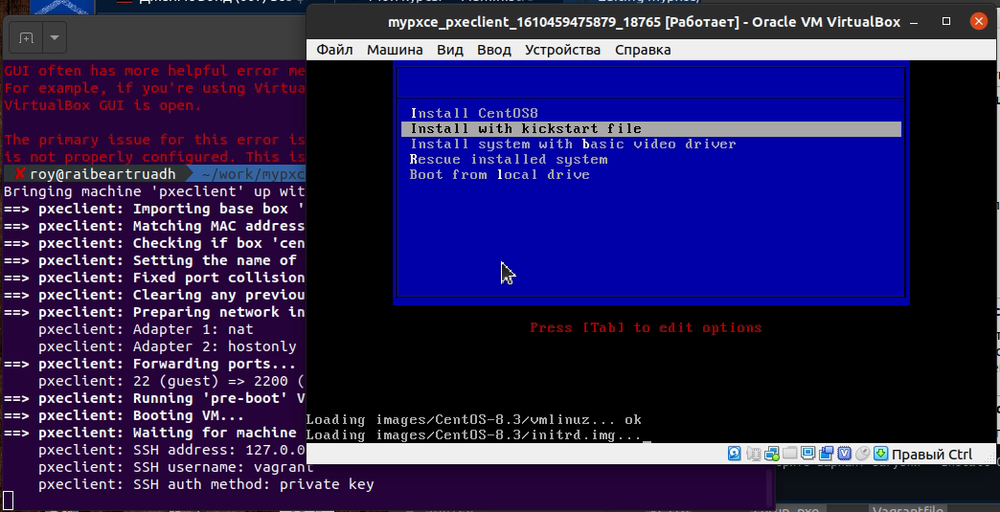
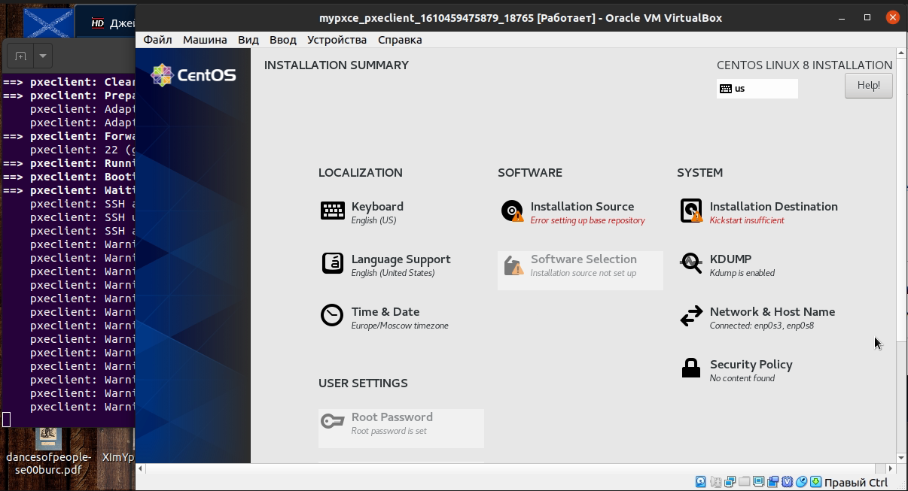

# Для проверки работы вам потребуется установить:
- Ansible 2.9.6
- Oracle VirtualBox 6.0
- Vagrant Vagrant 2.2.19

Если по команде vagrant up из основной директории проекта выдает ошибку образа, требуется скачать и установить образ, аналогичный Centos 7 -  https://app.vagrantup.com/centos/boxes/7
Также трубется заменить название образа, которое вы указали при загрузке (команда vagrant box add --name ИМЯ_ОБРАЗА URL or Address to Image) в файле Vagrantfile проекта.

      Vagrant.configure("2") do |config|
         config.vm.box = "ИМЯ_ОБРАЗА"

------------------------------------------------------------

# Задание

Настройка PXE сервера для автоматической установки
Цель: Отрабатываем навыки установки и настройки DHCP, TFTP, PXE загрузчика и автоматической загрузки
1. Следуя шагам из документа https://docs.centos.org/en-US/8-docs/advanced-install/assembly_preparing-for-a-network-install установить и настроить загрузку по сети для дистрибутива CentOS8
В качестве шаблона воспользуйтесь репозиторием https://github.com/nixuser/virtlab/tree/main/centos_pxe
2. Поменять установку из репозитория NFS на установку из репозитория HTTP
3. Настройить автоматическую установку для созданного kickstart файла (*) Файл загружается по HTTP

# Решение

1. Для запуска стенда выполните первую часть:

        $ vagrant up pxeserver

При выполнении скрипта setup_pxe.sh, будут стянуты файлы из репозитория в облаке (важно проверять актуальность путей и версий со временем)

2. После загрузки сервера запустите клиента:

        $ vagrant up pxeclient

3. После вывода строчки pxeclient: SSH auth method: private key - откройте клиента и выберите вариант загузки - Install CentOS8 (по умолчанию стартует через 60 секунд)

4. Установка через kickstart файл:
- погасите и удалите pxeclient
- выполните пункт 2
- После вывода строчки pxeclient: SSH auth method: private key - откройте клиента
- В меню выберите вариант - Install with kickstart file
- убедитесь, что пользовательские данные (из файла ks.cfg) уже заполнены

